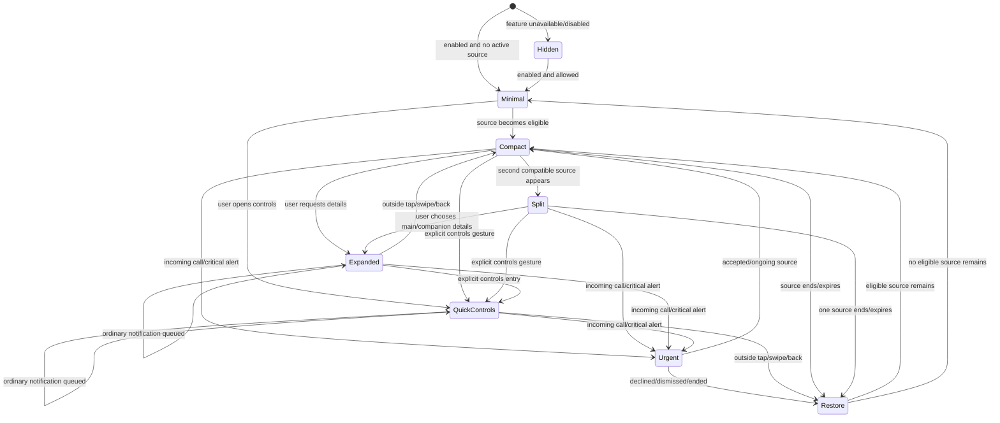

# Dynamic Island real-world behavior specification

This document defines how our Dynamic Island must behave in real use. It is a product and state-machine contract, not a copy of the reference app's code. The implementation must continue to use our own models, reducers, Android adapters, Compose components, visual language, motion, and interaction design.

The standard is simple: the island should feel calm, predictable, useful, and respectful of what the user is already doing. A new event may update the island, but it must not randomly take control of it.

## 1. User promises

1. **User intent is sticky.** If the user opened Quick Controls, a notification does not throw them out of Quick Controls.
2. **Urgency is earned.** Incoming calls and safety-critical alerts may interrupt. Ordinary messages, likes, promotions, and progress updates may not.
3. **Nothing is lost.** Deferred notifications remain queued and become available after the current interaction ends.
4. **One source owns one lifecycle.** A notification update refreshes its existing island item; it does not create duplicates or replay the entrance animation.
5. **The main and companion islands have clear ownership.** Each tap affects only the activity represented by that surface.
6. **A visual control must perform a real action.** Unsupported actions are hidden or routed to a truthful Android destination.
7. **The island returns to the right thing.** After a temporary event, it restores the user's active call, activity, notification queue, music, or minimal state in that order.
8. **No fabricated activity.** A timer ring, caller, progress value, device, or media state appears only when a real or explicitly previewed source exists.

## 2. Mental model

The app keeps two kinds of state separately:

- **Source state:** active call, media session, notification queue, timer, navigation, recording, transfer, battery event, Bluetooth event, and other Android producers.
- **Presentation state:** what the user is currently seeing or interacting with: minimal, compact, split, expanded detail, Quick Controls, or hidden.

A source can continue updating while another presentation is visible. For example, music keeps progressing while Quick Controls is open, and a message is queued while an incoming call is visible.

The visible island is selected from four inputs:

1. urgent interruption;
2. user-owned presentation;
3. highest-priority active source;
4. most recent eligible transient event.

This separation prevents background updates from destroying a user interaction.

## 3. Presentation states

| Presentation | Meaning | Who may replace it |
| --- | --- | --- |
| Hidden | Island disabled, disallowed on lock screen, or intentionally suppressed | Only user/settings or service lifecycle |
| Minimal | No active content needing attention | Any eligible source |
| Compact main | One active source | Urgent source or user action |
| Split main + companion | Two related/concurrent sources | Urgent source or user action |
| Expanded activity | User is reading or controlling one source | Incoming call or critical system alert only |
| Expanded notification pager | User is reading/acting on notifications | Incoming call or critical system alert only |
| Quick Controls | User explicitly opened controls | Incoming call or critical system alert only |
| Transient confirmation | Short system feedback such as volume or charging | Urgent source; otherwise it finishes first |

## 4. Priority and interruption policy

Priority is not just an ordering number. It also decides whether an event can interrupt the current presentation.

| Tier | Events | Behavior |
| --- | --- | --- |
| P0 — safety/communication | Incoming native or VoIP call, emergency/satellite failure requiring action | Interrupt immediately; preserve recoverable user context |
| P1 — active communication | Ongoing/dialing call | Own the island; all ordinary notifications queue silently |
| P2 — user-owned surface | Quick Controls, expanded notification, expanded media/activity, reply flow | Never replaced by an ordinary notification or transient system event |
| P3 — time-critical live work | Navigation maneuver, alarm/timer expiry, recording, screen sharing, active transfer | Stay visible; ordinary notifications queue; urgent call may interrupt |
| P4 — high-value fresh alert | Direct message, missed call, OTP, delivery arrival, calendar start | Peek only when no P0–P3 surface owns the island |
| P5 — system confirmation | Ringer/volume, charging, low battery, Bluetooth connected | Brief confirmation; repeated updates modify in place |
| P6 — media | Playing or paused media | Coexists with notifications through a split state |
| P7 — ordinary notification | Social, email, promotion, background completion | Queue and show only when the island is free |
| P8 — resting | Minimal | Default fallback |

### Mandatory interruption rules

- A notification posted while Quick Controls is open increments the notification badge and enters the queue. Quick Controls stays open.
- A notification posted while a slider, tile, app shortcut, or contact shortcut is being used never changes the visible state.
- A notification posted while an expanded notification is being read updates the queue without changing the selected page.
- A notification posted while expanded music or a live activity is open waits until that surface collapses.
- A notification posted during a call waits until the call ends. A missed-call notification may close a stale ringing state only when the call source itself has ended.
- Volume, charging, ringer, and Bluetooth events do not replace Quick Controls or another expanded user-owned surface.
- An incoming call may interrupt Quick Controls. If declined quickly, Quick Controls may be restored in the same unlocked session. If accepted, the ongoing call becomes the owner and Quick Controls is not reopened after a long call.
- A critical alert never erases the interrupted source; dismissal restores the previous eligible state.

## 5. Top-level state machine

## 6. Interaction contract

### 6.1 Single tap on the main island

| Visible state | Main single tap |
| --- | --- |
| Minimal | Open Quick Controls if enabled; otherwise no fake action |
| Compact notification | Open the island's notification detail at the visible notification |
| Compact music | Expand media controls; a dedicated source-app action may open the player app |
| Compact ongoing call | Expand call controls |
| Compact timer/live activity | Expand that activity |
| Split notification + music | Main tap opens whichever source is visibly in the main capsule |
| Split multi-notification | Main tap opens the currently visible notification |
| Charging/ringer/volume/Bluetooth confirmation | Expand only if the state has a meaningful action; otherwise acknowledge/collapse |
| Expanded surface | Background tap does nothing; it must not accidentally collapse while the user targets a control |
| Quick Controls | Background tap does nothing |

### 6.2 Single tap on the companion island

The companion bubble is a separate destination, not a second copy of the main tap.

| Split state | Companion single tap |
| --- | --- |
| Music + notification | Open notification detail when the main shows music; open media controls when the main shows notifications |
| Multiple notifications with a specific app icon | Select that notification and open its detail |
| Multiple notifications with `+N` count | Open the notification pager; do not silently cycle with no explanation |
| Timer companion | Open timer detail; play/pause belongs to an explicit control, not an ambiguous bubble tap |
| Ongoing call companion | Expand call controls |
| Charging/ringer companion | Open meaningful details when available; otherwise acknowledge the confirmation |
| Minimal with no real secondary source | No companion bubble should exist |

### 6.3 Long press

| Context | Long press |
| --- | --- |
| Minimal | Open Quick Controls with strong haptic feedback |
| Compact main | Expand the represented activity without leaving the current app |
| Companion bubble | Expand the companion activity without changing the main source |
| Expanded surface | No state change; controls remain stable |
| Quick Controls | No state change |

Quick Controls should also have an explicit entry affordance so discoverability does not depend only on a hidden gesture.

### 6.4 Swipe, outside tap, and back

- Swipe up on an expanded surface collapses it to compact; it does not destroy the underlying source.
- Swipe up on a compact dismissible notification hides that island item and advances to the next queued item.
- Swipe up must never end a call, cancel a timer, stop navigation, stop recording, or dismiss a non-clearable Android notification.
- Outside tap collapses Quick Controls or an expanded surface once. It does not clear notification history.
- Back from a focused reply closes the reply UI and returns to the same notification page.
- Every collapsed surface resumes the highest eligible source and starts its visibility timer only when it becomes visible.

## 7. Quick Controls scenarios

### QC-01 — New ordinary notification while browsing controls

**Given:** Quick Controls is open.  
**When:** WhatsApp, email, Instagram, or another ordinary notification arrives.  
**Then:**

- Quick Controls remains visible with no morph or layout jump.
- Notification count updates in place.
- Optional subtle badge pulse/haptic occurs once, respecting system settings.
- Notification is queued but its display timeout does not begin yet.
- Closing Quick Controls reveals the highest-priority queued notification.

### QC-02 — Several notifications while using a slider

- Slider drag remains uninterrupted.
- Brightness/volume value is not reset by recomposition.
- Badge count updates at most once per animation frame/batch.
- On release, the requested system value remains applied.
- Closing controls opens the notification pager at the highest-priority unread item.

### QC-03 — Incoming call while controls are open

- Incoming call interrupts immediately.
- Current control state is preserved in memory.
- Declining before leaving the current unlocked session restores Quick Controls.
- Accepting transitions to the ongoing-call island; controls stay closed.

### QC-04 — Volume/ringer/charging/Bluetooth update while controls are open

- Quick Controls remains visible.
- Relevant tile/slider updates in place.
- No second island is placed over the controls.
- A low-battery emergency may show a small non-blocking status treatment but not steal focus.

### QC-05 — Screen locks while controls are open

- Controls collapse immediately to prevent accidental actions.
- Lock-screen visibility/privacy preference is applied.
- Unlocking returns to the normal highest-priority source, not stale controls.

## 8. Notification lifecycle

### 8.1 New notification

1. Validate source and content.
2. Deduplicate by stable notification id; use group/sender matching only as a safe fallback.
3. Store or merge it in the queue.
4. Classify urgency and source type.
5. Decide whether the current presentation can be interrupted.
6. If deferred, do not start its visible timeout.
7. If shown, animate once into compact/split presentation.

### 8.2 Notification update

- Progress, chronometer, call status, media position, and message-content updates modify the same item.
- Progress-only updates never reorder the queue or replay the entrance animation.
- An updated selected notification stays selected.
- A group summary does not duplicate its child notifications.
- If actions change, replace stale PendingIntents atomically.

### 8.3 Notification removal

- Remove only the matching queue item and source actions.
- If it owns a specialized live activity, clear that activity too.
- If the removed item is selected, move to the nearest remaining item.
- If nothing remains, restore active live activity, media, or minimal state.
- Removal never ends an unrelated call, recording, timer, or transfer.

### 8.4 Visible timeout

- Timeout starts when the item becomes visible, not when it arrived behind another surface.
- Expanded notification reading/reply pauses timeout.
- Ongoing/non-clearable live notifications do not expire while their source remains active.
- A new update resets timeout only when it materially changes user-visible content.
- Timeout hides the island presentation; it does not cancel the Android notification.

## 9. Notification type scenarios

| Type | Compact behavior | Expanded behavior | End condition |
| --- | --- | --- | --- |
| Direct message/conversation | App icon, sender, concise line | Full sender/body, conversation lines, Reply/Read actions | User action, timeout, or source removal |
| OTP/sensitive content | App identity and masked content on lock screen | Reveal only when privacy allows | Timeout/source removal |
| Grouped messages | One group entry with count | Pager/conversation items without duplicate summary | Children removed or group cleared |
| Missed call | High-value alert after ringing source ends | Call back/message/contact actions | Action, timeout, source removal |
| Native incoming call | Immediate expanded call state | Accept/decline | Telecom state change |
| VoIP CallStyle incoming | Immediate expanded call state | Source Answer/Decline PendingIntents | Notification transition/removal |
| Ongoing/dialing call | Compact caller + Calling/live duration | Mute/speaker/end or source Hang up | Phone/notification source ends |
| Media | Compact art/title/playback identity | Scrubber and supported transport controls | Session stops/removal |
| Navigation | Stable compact maneuver | Route detail and truthful destination action | Navigation source ends |
| Timer/alarm/stopwatch | Live ring/time; no repeated animation | Pause/resume/cancel only when supported | Source ends/cancelled |
| Download/upload | App icon + real progress | File/task details and source action | Completed/removed |
| Delivery/ride | Status and ETA from source | Current step and source destination | Delivered/cancelled/removed |
| Recording | Persistent red/live identity | Stop only through real source action | Recording notification ends |
| Screen mirroring/casting | Persistent route/device | Stop/open route controls when supported | Route deselected/source removed |
| Nearby/Quick Share | Device + real progress | Pause/cancel/open only when source exposes it | Transfer ends/removal |
| Bluetooth accessory | Brief connected/device battery | Bluetooth destination if useful | Confirmation timeout/disconnect update |
| Battery/charging | Brief real percentage | Battery destination only if actionable | Timeout/unplug/recovery |
| Ringer/media volume | Update same compact HUD in place | Optional direct slider | Short idle timeout |
| Focus/DND | Brief or persistent status based on source | DND settings | Filter disabled |
| Flight/sports/transit | Show only from strict recognized source | Live detail with source app destination | Source ends/removal |
| Promotion/silent background | Queue quietly; no forced expansion | Standard notification detail if user opens pager | Timeout/removal |
| Foreground-service noise | Suppress unless it has progress, controls, or meaningful live status | Only meaningful content | Service ends |

## 10. Multiple-notification behavior

### One notification

- Main capsule represents that notification.
- Single tap opens its detail.
- Long press also expands detail for Apple-like direct manipulation.
- Swipe dismisses only if the notification is clearable.

### Two or more notifications

- Queue order: urgent/priority first, then ongoing, then newest.
- Updating an existing item does not create a new item.
- Main capsule shows the active notification.
- Companion with a specific icon opens that item.
- Companion with a count opens the pager at the next unread item.
- Pager selection remains stable when a new ordinary notification arrives.
- Removing the selected item chooses the nearest surviving item.
- The queue is bounded; overflow removes oldest non-ongoing low-priority entries first, never active calls or live work.

### Burst protection

- Several messages arriving within a short burst merge into one calm transition.
- Do not replay width/height morph for every message in the burst.
- Haptic/sound behavior follows Android notification policy; the overlay does not add repeated noise.

## 11. Concurrent-source matrix

| Existing state | New event | Expected visible result |
| --- | --- | --- |
| Quick Controls | Ordinary notification | Keep controls; update badge; queue alert |
| Quick Controls | Volume/ringer/charging/BT | Keep controls; update relevant value silently |
| Quick Controls | Incoming call | Show incoming call; preserve short-session restore context |
| Expanded notification | New ordinary notification | Keep selected page; update count/queue |
| Expanded notification | Incoming call | Show call; restore pager after decline when appropriate |
| Expanded music | Ordinary notification | Keep player; queue notification; expose after collapse |
| Compact music | Ordinary notification | Show notification + music split state |
| Ongoing call | Any ordinary notification | Keep call; queue notification |
| Ongoing call | Second call/call waiting | Show call-waiting identity/actions if platform provides them |
| Timer/navigation/recording | Ordinary notification | Keep live activity; queue notification |
| Timer | Navigation starts | Navigation wins visible live slot; timer remains companion/queued source |
| Navigation | Timer expires | Timer expiry may briefly interrupt as time-critical, then restore navigation |
| Recording | Incoming call | Call interrupts; recording continues and returns after call |
| Charging confirmation | Message arrives | Finish short charging confirmation, then show message |
| Notification peek | Volume key pressed | Volume HUD may temporarily overlay only if no user-expanded surface; then return to notification |
| Multiple notifications | Music starts | Preserve queue and show a notification/music split state |
| Screen lock | Sensitive notification | Mask private content or hide per preference |
| Service restart | Active Android sources exist | Rehydrate once without replaying every entrance animation |

## 12. Source-specific actions

- Notification PendingIntents stay in the service layer, addressed by stable ids.
- Compose receives semantic actions only: Open, Reply, Answer, Decline, Hang up, Pause, Resume, Stop, Undo, Settings, and similar.
- If a source action expires or throws, the island remains stable and offers a safe fallback destination when one exists.
- A local dismiss hides the island item. It cancels the Android notification only when the user explicitly chooses a clear/dismiss action and Android permits it.
- Find My/Handoff-style activities use strict known sources and preserve Open/Undo/Continue actions. No universal Android capability is claimed where none exists.

## 13. Calls

### Incoming

- Highest-priority user-visible state.
- Show caller identity only when permissions/privacy allow it.
- Answer/Decline must execute a real Telecom or source CallStyle action before changing local state.
- New messages queue without visual interruption.

### Dialing and ongoing

- “Calling…” is distinct from connected duration.
- Duration starts only after connection.
- Compact main shows caller and status/duration; companion opens call controls.
- Expanded controls show only capabilities actually supported for that source.
- Ending the call restores summary, deferred notification, live activity, music, or minimal state according to policy.

### Call waiting and handoff

- A second incoming call may temporarily replace the current call detail only when Android provides authoritative actions.
- Decline returns to the original ongoing call.
- Accept transitions the original call according to Telecom state; the island does not guess hold/swap success.
- VoIP notification handoff is driven by source notification updates/removal.

## 14. Live activities

- Live activities are registry-backed and keyed by stable source id.
- Multiple activities remain active; one visible primary is chosen deterministically.
- Priority should favor immediate user risk and time sensitivity, then recency.
- Ongoing source updates change data in place without stealing an expanded user surface.
- A source-backed activity must disappear when its source notification/session/route disappears.
- App previews are explicitly labeled and never impersonate a real system activity.

## 15. Lock screen, privacy, and permissions

- Respect island enabled, always-on-top, and lock-screen visibility settings.
- Quick Controls never remain expanded after screen lock.
- Mask notification body, OTP, caller name, and artwork on the lock screen when content is sensitive or user privacy requests it.
- Notification access revoked: clear source PendingIntents and show a setup state in the app, not a broken island.
- Accessibility/overlay access revoked: stop rendering cleanly; do not keep background state pretending the island is visible.
- Contacts/phone permission missing: show safe identity fallback and route calls through the dialer where required.
- DND and Android notification-channel decisions remain authoritative.

## 16. Motion, haptics, and visual stability

- State changes morph from the top cutout with one spring; content cross-fades after geometry begins.
- Data updates inside the same state do not replay the full morph.
- Notification bursts are coalesced.
- Main and companion surfaces press independently.
- Urgent interruption uses one clear haptic; ordinary queued events do not add haptics while a user-owned surface is open.
- Reduced-motion preference replaces morph/bounce with short fades.
- Text length, font scaling, RTL, and missing artwork must not change compact height or push controls outside the touch target.

## 17. Accessibility

- Main and companion islands expose different content descriptions and actions.
- Every tappable target is at least 44dp logically, even when its visible glyph is smaller.
- TalkBack announces state changes only when visible and important; deferred notifications are not announced again by the overlay.
- Action labels describe outcomes: “Open notification from…”, “Expand call controls”, “Pause timer”, and “Dismiss island alert”.
- Pager position and notification count are announced.
- Color is never the only indicator of urgency, call state, battery status, or enabled controls.

## 18. Failure and recovery cases

| Failure | Required behavior |
| --- | --- |
| PendingIntent cancelled | Keep state stable, remove dead action, offer source app/settings fallback if available |
| Source app uninstalled | Reconcile shortcut/activity and remove it without crash |
| Notification listener reconnects | Rehydrate active notifications once, deduplicate, preserve ongoing progress |
| Overlay service restarts | Rebuild from authoritative Android sources; do not replay stale transient confirmations |
| Media session disappears | Remove media state and restore queue/live/minimal |
| Bluetooth name/battery unavailable | Show generic device identity; never invent battery |
| Contact lookup fails | Show number/private caller fallback |
| Network unavailable | Island sources continue locally; remote config/analytics failure never blocks controls |
| Very long text/emoji/RTL | Ellipsize compact content; preserve full accessible/expanded text |
| App process killed during reply | Android notification remains; no false “sent” state |

## 19. Reducer invariants

These rules must become automated tests:

1. Posting an ordinary notification while `ActionControl` is visible keeps `ActionControl` visible and increments its count.
2. Closing `ActionControl` reveals the highest-priority queued notification and starts its timeout then.
3. Posting while an expanded notification is visible preserves the selected notification id.
4. Posting while an expanded media/live surface is visible queues without replacing it.
5. Posting during an incoming/ongoing call never replaces the call.
6. Updating an ongoing notification changes it in place and preserves queue order/selection.
7. Removing one source clears only that source and its actions.
8. A transient state restores the correct highest-priority source.
9. Swipe on a non-dismissible ongoing source never stops or clears it.
10. Main and companion taps route to different owners in split states.
11. A deferred notification's timeout starts only when it first becomes visible.
12. A user-opened surface has an exit and cannot become a dead-end state.

## 20. Acceptance scenarios

Before declaring the island behavior complete, verify at least the following on a connected device:

- Open Quick Controls, drag brightness, and receive one then five notifications.
- Open Quick Controls and press volume keys, connect Bluetooth, plug in power, and toggle ringer mode.
- Read notification page 2 of 4 while another notification arrives and one is removed.
- Play music, receive notifications paused and playing, then tap main and companion independently.
- Start timer + navigation + media and confirm deterministic ownership/restoration.
- Receive, decline, answer, connect, and end native and CallStyle/VoIP calls with queued notifications.
- Lock/unlock with private notification content and each lock-screen preference.
- Revoke/restore notification and accessibility permissions while sources are active.
- Restart listener/overlay process with active media, ongoing notification, and multiple queued messages.
- Enable large fonts, TalkBack, RTL locale, reduced motion, and narrow/wide device widths.

## 21. Implementation status

Implemented and covered by pure policy/reducer tests where the behavior does not require Android framework integration:

- [x] A pure notification interruption policy now distinguishes present, defer, preserve-controls, and update-expanded behavior.
- [x] Quick Controls remain visible and their notification count updates when notifications are posted or removed.
- [x] Opening Quick Controls cancels any old notification expiry timer.
- [x] Closing Quick Controls reveals queued notifications and only then starts their visibility timeout.
- [x] Expanded notification selection and pager position survive posts, updates, unrelated removals, and queue capping.
- [x] Notifications are keyed only by Android's stable source key; group summaries do not duplicate child notifications.
- [x] Expanded media, live activities, calls, and transient confirmations defer ordinary notifications without burning their timeout.
- [x] Background media, live-activity, charging, volume, ringer, Bluetooth, call-summary, and premium callbacks cannot replace a higher-priority or user-owned surface.
- [x] Main and companion taps/long presses route independently in notification, notification/media, call, live, and minimal states.
- [x] Swipe collapses expanded surfaces, dismisses only clearable notifications, and never ends calls, timers, navigation, recording, media, or other ongoing sources.
- [x] Incoming calls preserve short-session user context; decline restores it and accept transfers ownership to the ongoing call. Call-waiting decline can restore the represented ongoing call when authoritative actions are available.
- [x] Safety-critical alarms may interrupt, ordinary notifications cannot replace them, and the interrupted eligible surface returns after the final critical alert ends.
- [x] Source-backed live activities use strict source recognition, deterministic risk/recency priority, truthful source text/progress/chronometers, and only actions actually exposed by the source.
- [x] Notification action updates replace stale PendingIntents; cancelled actions are removed, and failed inline replies remain open with a recovery message.
- [x] Listener reconnect reconciles and rehydrates active Android notifications; disconnect/revocation clears stale actions, mapped activities, queues, and media sessions.
- [x] Locking collapses interactive surfaces and optionally masks sensitive notification/caller content and actions without ending the underlying source.
- [x] Reduced motion is persisted and removes island geometry bounce, press scale, breathing, shimmer, and reveal motion in favor of short fades.
- [x] Dynamic Island compact geometry remains on the shared audited token system; behavioral work does not alter canonical compact height or responsive width calibration.

Platform limits remain authoritative: call waiting/hold/swap, app-specific transfer controls, and similar operations appear only when Android or the source notification exposes a real action. They are never simulated locally. The connected-device scenarios in section 20 remain the release checklist for OEM-specific behavior and permissions.
